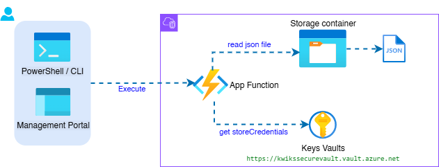

# Azure Vault with App Function

This is an example of an azure app function to read a json file from the storage container, the authentication key to the store is retrieved beforehand from azure vault.

